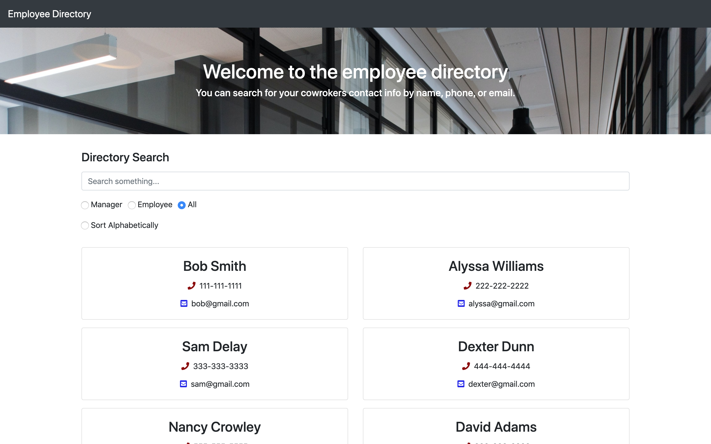

# EmployeeDirectory

## Instructions

For this assignment, you'll create a employee directory with React. This assignment will require you to break up your application's UI into components, manage component state, and respond to user events.

Link to the live website: (https://employeedirectory1350149.netlify.app/)

## Acceptance criteria

Given a table of random users, when the user loads the page, a table of employees should render. 

The user should be able to:

  * Sort the table by at least one category

  * Filter the users by at least one property.

## Built with

- React
- Javascript
- Bootstrap

## Installation and Start

- Run "npm install"
- Run "npm start"

